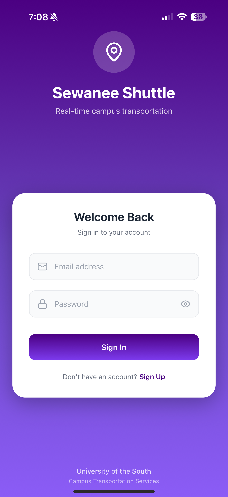
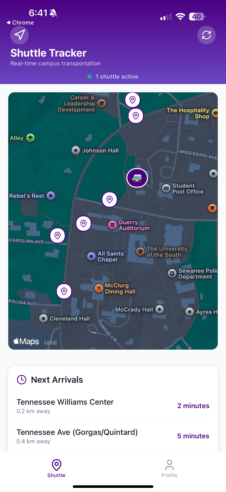
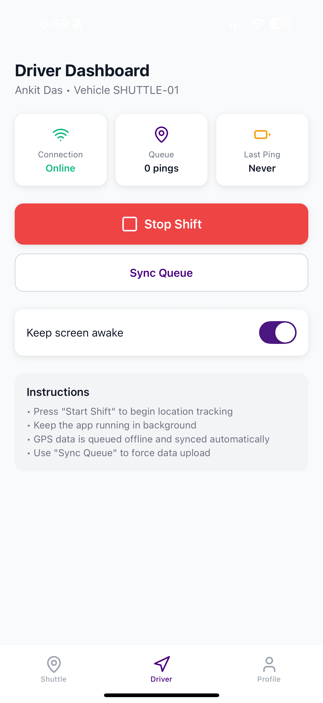
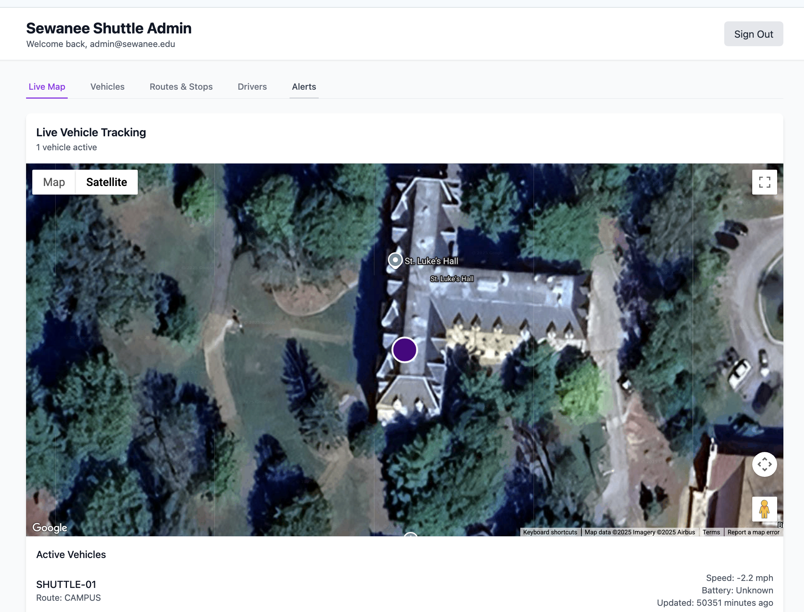

# 🚐 Sewanee Shuttle Tracker

> Real-time campus shuttle tracking system serving 500+ students at Sewanee: The University of the South

[](https://reactnative.dev/)
[](https://www.typescriptlang.org/)
[](https://supabase.com/)
[](https://expo.dev/)

A comprehensive real-time shuttle tracking solution featuring GPS tracking, ETA predictions, and multi-role dashboards for students, drivers, and administrators.

## 📸 Screenshots

### Authentication & Student Experience
<div align="center">
  
  
</div>

*Clean authentication and real-time shuttle tracking with live location updates*

### Driver Dashboard
<div align="center">
  
</div>

*Driver interface with GPS tracking, shift management, and connection monitoring*

### Admin Dashboard
<div align="center">
  
</div>

*Web-based admin panel with live fleet monitoring and vehicle management*

## ✨ Key Features

### 📍 Real-Time GPS Tracking
- Live location updates every 10 seconds
- Background tracking with offline queue support
- Automatic route snapping and progress calculation

### ⏱️ Smart ETA Predictions
- Dynamic arrival time calculations
- Distance-based predictions for all shuttle stops
- Real-time updates as shuttle moves

### 👥 Multi-Role Access
- **Students**: Track shuttles and view ETAs
- **Drivers**: Start shifts and broadcast location
- **Admins**: Monitor fleet and manage system

### 🔄 Real-Time Synchronization
- Supabase Realtime for instant updates
- WebSocket connections for all clients
- Automatic reconnection handling

### 🗺️ Interactive Maps
- 14 authentic Sewanee campus stops
- Custom markers and route visualization
- Satellite and street view options

## Architecture

- **Backend**: Supabase (Auth, Postgres + PostGIS, Realtime, Edge Functions)
- **Mobile Apps**: React Native with Expo (driver and student apps)
- **Admin Dashboard**: Next.js web application
- **Maps**: React Native Maps, MapLibre GL

## 📱 Features

### Student App
- Live map showing shuttle locations in real-time
- ETA calculations for upcoming stops
- Service alerts and notifications
- Automatic updates via Supabase Realtime

### Driver App
- Background GPS tracking with offline queuing
- Start/stop shift functionality
- Battery and connection status monitoring
- Automatic route snapping and progress calculation

### Admin Dashboard
- Live fleet monitoring and management
- Vehicle status and analytics
- Service alert management
- Route and stop management

## Getting Started

### Prerequisites
- Node.js 18+
- Expo CLI (`npm install -g @expo/cli`)
- Supabase account

### Quick Setup
Run the automated setup script:
```bash
./setup.sh
```

Or follow the manual steps below:

### 1. Supabase Setup

1. Create a new Supabase project at [supabase.com](https://supabase.com)
2. Run the database migration:
   - Go to SQL Editor in your Supabase dashboard
   - Copy and paste the contents of `supabase/migrations/20250905065815_bitter_harbor.sql`
   - Execute the migration
3. Deploy the edge function:
   ```bash
   # Install Supabase CLI first: https://supabase.com/docs/guides/cli
   supabase functions deploy ingest
   ```
4. Create an admin user:
   - Sign up through your Supabase Auth UI
   - Note the user UUID from the auth.users table
   - Insert their role: 
   ```sql
   INSERT INTO user_roles (user_id, role) VALUES ('YOUR_USER_UUID_HERE', 'admin');
   ```

### 2. Environment Variables

Copy the example files and add your Supabase credentials:
```bash
cp .env.example .env
cp admin-dashboard/.env.local.example admin-dashboard/.env.local
```

Edit both files with your Supabase project URL and anon key (found in Settings > API):
```env
EXPO_PUBLIC_SUPABASE_URL=https://your-project.supabase.co
EXPO_PUBLIC_SUPABASE_ANON_KEY=your_supabase_anon_key_here
```

### 3. Install Dependencies

```bash
# Mobile app dependencies
npm install

# Admin dashboard dependencies
cd admin-dashboard
npm install
cd ..
```

### 4. Running the Applications

#### Mobile Apps (Expo)
```bash
npm run dev
# This starts the Expo development server
# You can then run on iOS simulator, Android emulator, or physical device
```

#### Admin Dashboard
```bash
cd admin-dashboard
npm run dev
# Available at http://localhost:3001
```

### 5. Testing the System

Run the automated test suite:
```bash
./test-system.sh
```

### 6. Creating Test Users

1. **Admin User**: Already created in step 1.4
2. **Driver User**: 
   - Sign up through Supabase Auth
   - Insert role: `INSERT INTO user_roles (user_id, role) VALUES ('DRIVER_UUID', 'driver');`
   - Insert driver profile: `INSERT INTO drivers (user_id, name, assigned_vehicle) VALUES ('DRIVER_UUID', 'Test Driver', 'VEHICLE_UUID');`
3. **Student User**: 
   - Sign up through Supabase Auth  
   - Role defaults to 'student', no additional setup needed

## 🗄️ Database Schema

### Core Tables
- `routes` - Bus routes with colors and names
- `shapes` - Route geometries as PostGIS LineStrings
- `stops` - Bus stops with locations and sequences
- `vehicles` - Fleet vehicles with labels and route assignments
- `drivers` - Driver profiles with vehicle assignments
- `vehicle_positions` - GPS ping history (append-only)
- `vehicle_latest` - Current vehicle positions (materialized)
- `alerts` - Service alerts and notifications
- `user_roles` - Role-based access control

### Key Features
- **PostGIS Integration**: Geospatial route snapping and distance calculations
- **Real-time Updates**: Automatic position updates via triggers
- **Row Level Security**: Role-based data access control
- **ETA Calculations**: View-based ETA estimates using distance/speed

##  Security

### Authentication
- Supabase Auth with email/password
- JWT-based API authentication
- Role-based access control (admin, driver, student)

### Row Level Security (RLS)
- Drivers can only insert GPS data for their assigned vehicle
- Students can read live vehicle positions
- Admins have full management access

## 🚛 Deployment

### Mobile Apps
```bash
# Build for production
expo build

# For app stores
eas build --platform all
```

### Admin Dashboard
```bash
cd admin-dashboard
npm run build

# Deploy to Vercel, Netlify, etc.
```

### Supabase
- Database migrations are version controlled
- Edge functions auto-deploy
- Configure environment variables in Supabase dashboard

## 📊 Monitoring

The system includes built-in monitoring for:
- Vehicle connection status
- GPS accuracy and battery levels
- Alert management and delivery
- Driver shift tracking

## 🛠️ Development Notes

### GPS Tracking
- Background location updates every 5 seconds
- Offline queue system with automatic retry
- Route snapping using PostGIS functions
- Battery and accuracy monitoring

### Real-time Features
- Supabase Realtime for live updates
- WebSocket connections for instant notifications
- Automatic reconnection handling

### Performance
- Indexed database queries
- Spatial indexes for geospatial operations
- Connection pooling and caching
- Optimized mobile app size

## License

This project is licensed under the MIT License - see the [LICENSE](LICENSE) file for details.

##  Built for University of the South

Designed specifically for the Sewanee campus with:
- Campus-specific sample data
- University branding (purple/gold)
- Optimized for small campus operations
- Integration-ready for university systems
